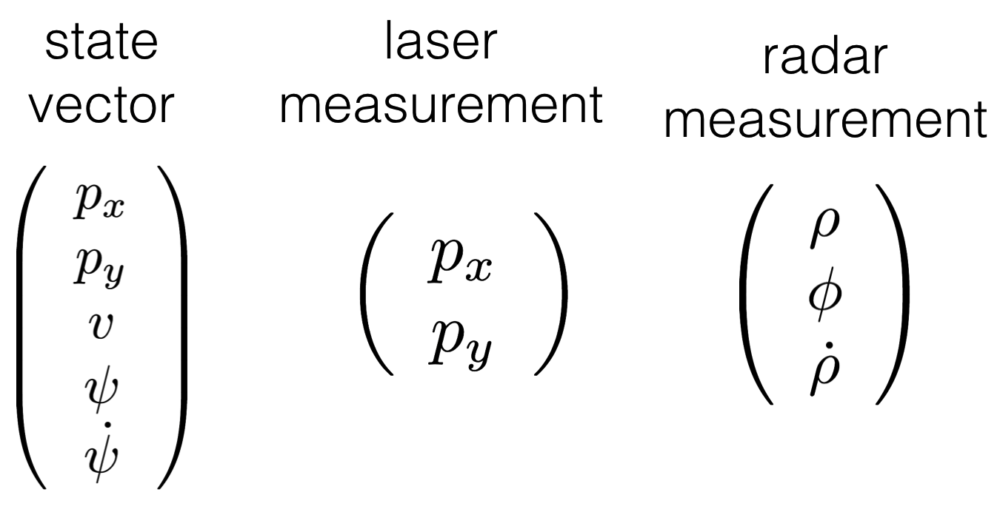
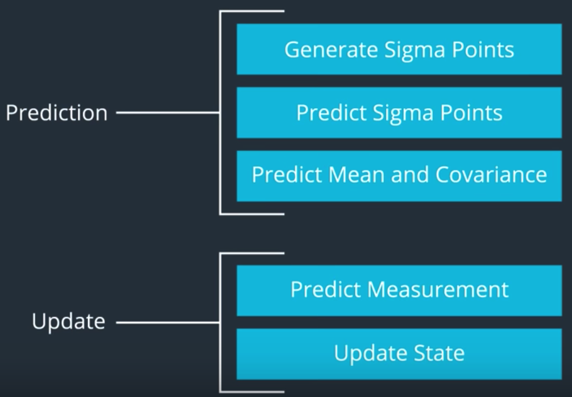
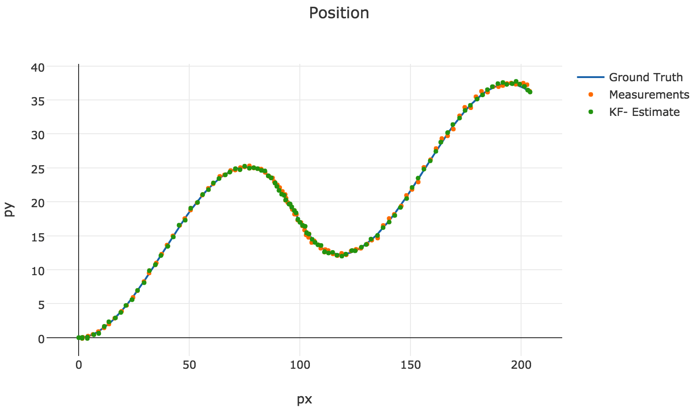
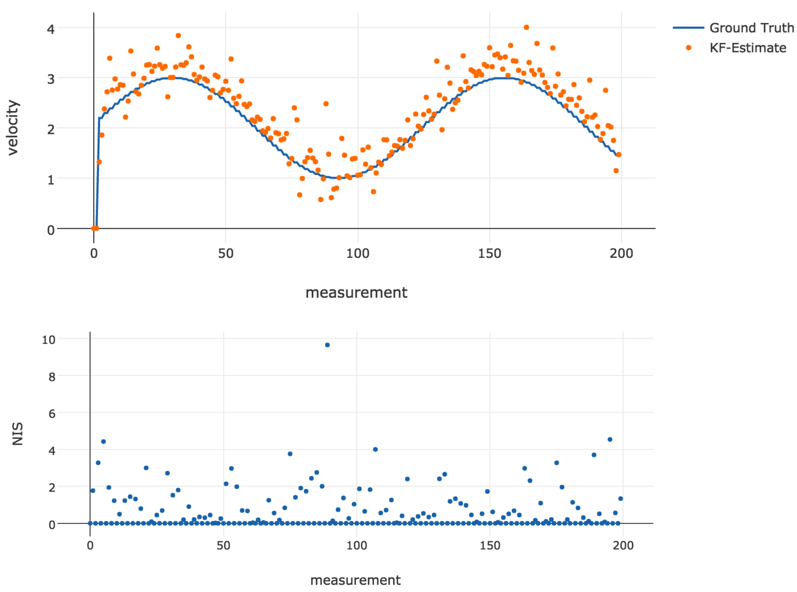
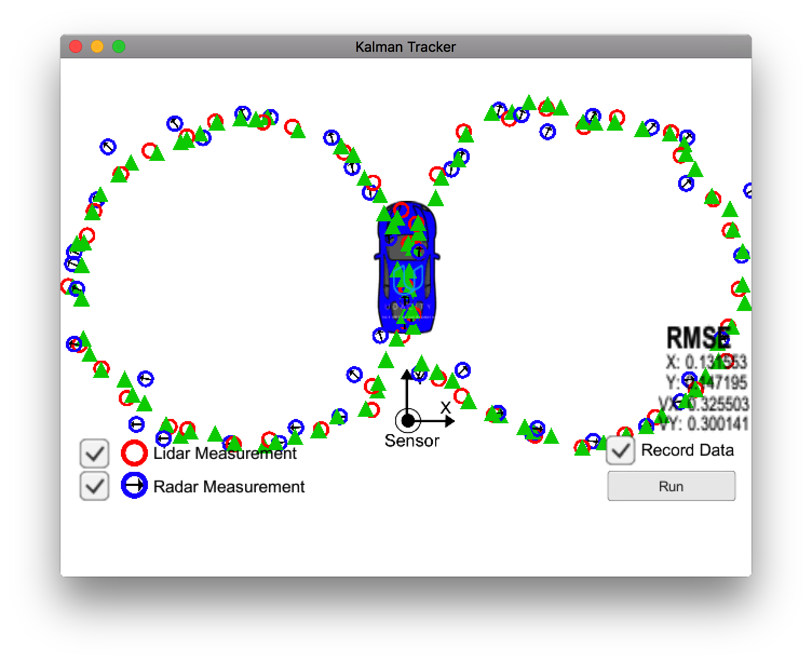

# Unscented Kalman Filter Project

This is a project for Udacity self-driving car Nanodegree program. The aim of this project is to implement an unscented Kalman filter in C++ to fuse laser and radar measurements of a moving object.

## Structure of unscented Kalman filter for CTRV model

The constant turn rate and velocity magnitude model (CTRV) assumes the moving object has a constant turning rate and a constant magnitude of velocity.

The state vector for this model contains:

1. the position along x-axis
2. the position along y-axis
3. the magnitude of velocity
4. the yaw angle
5. the change rate of yaw angle

The laser can directly measure:

1. the position along x-axis
2. the position along y-axis

The radar can directly measure:

1. the radial distance from origin (range)
2. the angle between the radial distance and the x-axis (bearing)
3. the change rate of the distance from origin (range rate)

Since the process model is nonlinear, the original Kalman filter cannot be applied. Instead we us the unscented Kalman filter (UKF) to estimate the state of the system. The UKF uses sigma points to approximate the non-gaussian distributed uncertainties. The UKF processing chain contains:

- Prediction
  * Generate sigma points
  * Predict sigma points
  * Predict mean and covariance
- Update  
  * Predict measurement
  * Update state

## Code structure

The implementation of the UKF is in the `UKF` class. The main function that process a measurement data is

    ProcessMeasurement(MeasurementPackage meas_package)    // process one measurement data

This function will be called repeatedly when a measurement arrives. In this function, the prediction and update steps will be called:

    Prediction(double delta_t)                             // predict state and covariance at k+1|k
    UpdateLidar(MeasurementPackage meas_package)           // update state and covariance to k+1|k+1 using laser data
    UpdateRadar(MeasurementPackage meas_package)           // update state and covariance to k+1|k+1 using laser data
    Initialization(MeasurementPackage meas_package)        // initialization using the first measurement

In `Prediction()` there are three helper functions:

    CalculateAugmentedSigmaPoints()                        // calculate sigma points at state k|k
    PredictSigmaPoints(double delta_t)                     // predict sigma points at k+1|k
    PredictMeanAndCovariance()                             // predict state and covariance at k+1|k using sigma points at k+1|k

The `util` folder contains an ipython notebook for visualizing the output results of the Kalman filter, as well as a script that communicates between the simulator and the compiled c++ kalman filter program.

## Results

In this implementation, the process noise settings are:

1. `std_a_ = 1` which means the process noise standard deviation longitudinal acceleration is 1 m/s^2
2. `std_yawdd_ = 0.6` which means the process noise standard deviation yaw acceleration is 0.6 rad/s^2

This implementation can achieve a RMSE of `[0.07204, 0.0785547, 0.62881, 0.570763]` for data set 1 and `[0.19344, 0.189351, 0.444612, 0.533302]` for data set 2. The following plot shows the ground truth, measurements and the UKF-estimated of the object positions for data set 2. The estimated positions agrees well with the ground truth.

The following plots show the ground truth and estimated velocity. They again agree well. The NIS is also shown below. From the NIS we can check the consistence of the Kalman filter process. In this example, the NIS looks good and only have a few measurements greater than 7.8 (95% line).

This plot shows the results of the Kalman filter tracker. Note that when running the tracker, the data saving folder must be the same folder where the unscented Kalman filter executable locates.

